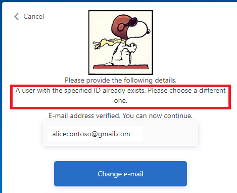

# Azure AD B2C account linkage

In Azure AD B2C you can havce a Local Account of alicecontoso@gmail.com at the same time, if you federate with Google's IDP, you can have another account authenticating as alicecontoso@gmail.com with Google. There is no correlation between the two account. You can view this two ways; either that the user choosed to have it this way or that it happened by mistake and the user doesn't want it this way. The sample on [account linkage](https://github.com/azure-ad-b2c/samples/tree/master/policies/account-linkage-unified) shows you how the user can correct the problem by joining the two accounts, but that is active action by the user. This sample shows you a different approach - avoiding that it happens in the first place.

## Scenario 1 - signup via federated Social IDP
When you sign up with a social account, like alicecontoso@gmail.com, as long as the IDP returns the email to B2C, we can add that to the user profile and set it up as Local Account too. Technically, there is no local password and the user can login that way, but we have effectively blocked ever creating a local account with that email address. And if Alice Contoso ever wanted to login as a local account, all she has to do is invoke the PasswordReset flow and set a new password.

Look at the `identities` collection below from the user profile. During normal signup from a social IDP, the types `federated` and `userPrincipalName` are created. If we add the `emailAddress` at the same time we have linked the email to this local account and no one else can create another user account with it.
 
```JSON
"identities": [
    {
        "signInType": "federated",
        "issuer": "google.com",
        "issuerAssignedId": "123456789012345678901"
    },
    {
        "signInType": "emailAddress",
        "issuer": "yourtenant.onmicrosoft.com",
        "issuerAssignedId": "alicecontoso@gmail.com"
    },
    {
        "signInType": "userPrincipalName",
        "issuer": "yourtenant.onmicrosoft.com",
        "issuerAssignedId": "cpim_e64aecf5-74ef-464c-8df0-2a414b81b269@yourtenant.onmicrosoft.com"
    }
],
```

## Scenario 2 - signup via Local Account then trying to use the Social acount
This scenario is not as easy as the one above, because when a user signs up with `alicecontoso@gmail.com`, we have no way knowing Google's unique id for the user, `123456789012345678901`, so we can't add that automatically. You might have the idea that if a user signs up with `@gmail.com`, why don't we do account linking during the signup user journey? That would be difficult to achieve since many social IDPs give you the option of aliasing any type of email address to your social account, so you would have no way of knowing during signup that this is really a Google account, etc. 

However, given what we implement in scenario 1, if there already is a local account `alicecontoso@gmail.com`, scenario 1 will give the user an error during signup saying "A user with the specified ID already exists. Please choose a different one." 




## Technical profiles
To achieve this solution, there is relative little changes to the standard B2C policies we have to do. It is actually just the below - we extend the Technical Profile `AAD-UserWriteUsingAlternativeSecurityId` to persist the email. This Technical Profile is used to write the user profile during Social Account signup, so what we add here isexactly what was described in scenario 1. The reason we create a random password is we need to prepare the account for the possibility that the user initiates the PasswordReset user journey. Without setting a random password, B2C will create the account in a way where password reset doesn't work.

If the social IDP doesn't return the email address to B2C, the email claim will be null and the `signInName.emailAddress` is not written. 

```xml
  <BuildingBlocks>
    <ClaimsTransformations>
      <ClaimsTransformation Id="CreateRandomPassword" TransformationMethod="CreateRandomString">
        <InputParameters>
          <InputParameter Id="randomGeneratorType" DataType="string" Value="GUID" />
        </InputParameters>
        <OutputClaims>
          <OutputClaim ClaimTypeReferenceId="newPassword" TransformationClaimType="outputClaim" />
        </OutputClaims>
      </ClaimsTransformation>
    </ClaimsTransformations>
  </BuildingBlocks>

  <ClaimsProviders>
    <ClaimsProvider>
      <DisplayName>Azure Active Directory</DisplayName>
      <TechnicalProfiles>
        <TechnicalProfile Id="AAD-UserWriteUsingAlternativeSecurityId">
          <InputClaimsTransformations>
            <InputClaimsTransformation ReferenceId="CreateRandomPassword" />
          </InputClaimsTransformations>
          <PersistedClaims>
            <PersistedClaim ClaimTypeReferenceId="email" PartnerClaimType="signInNames.emailAddress" />
            <PersistedClaim ClaimTypeReferenceId="newPassword" PartnerClaimType="password"/>
            <PersistedClaim ClaimTypeReferenceId="passwordPolicies" DefaultValue="DisablePasswordExpiration" />
          </PersistedClaims>
        </TechnicalProfile>
      </TechnicalProfiles>
    </ClaimsProvider>
  </ClaimsProviders>

```

## Notes

This sample policy is based on [SocialAndLocalAccounts starter pack](https://github.com/Azure-Samples/active-directory-b2c-custom-policy-starterpack/tree/master/SocialAndLocalAccounts). All changes are marked with **Sample:** comment inside the policy XML files. Make the necessary changes in the **Sample action required** sections. 

You then need to add your selected social providers that you want to federate with.

[Microsoft Accounts](https://docs.microsoft.com/en-us/azure/active-directory-b2c/identity-provider-microsoft-account-custom)

[Google]https://docs.microsoft.com/en-us/azure/active-directory-b2c/identity-provider-google-custom

## Community Help and Support

Use [Stack Overflow](https://stackoverflow.com/questions/tagged/azure-ad-b2c) to get support from the community. Ask your questions on Stack Overflow first and browse existing issues to see if someone has asked your question before. Make sure that your questions or comments are tagged with [azure-ad-b2c].
If you find a bug in the sample, please raise the issue on [GitHub Issues](https://github.com/azure-ad-b2c/samples/issues).
To provide product feedback, visit the Azure Active Directory B2C [Feedback page](https://feedback.azure.com/forums/169401-azure-active-directory?category_id=160596).

